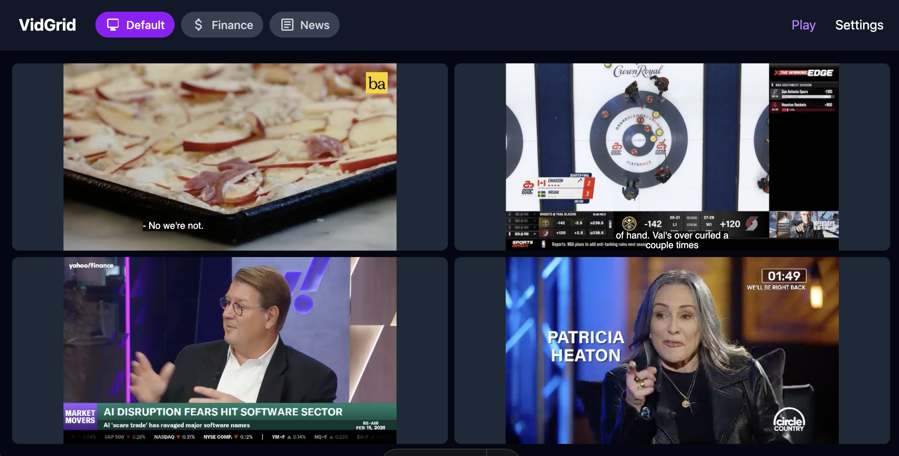

# VidGrid

A lightweight web application for displaying up to four video streams simultaneously in a 2x2 grid layout. Built for desktop users who need to monitor multiple live feeds or video sources at once.



## Features

- **2x2 Video Grid**: Display up to four video streams simultaneously
- **Multiple Stream Formats**: Supports HTML5 native formats (MP4, WebM) and HLS streams (.m3u8)
- **Playlist Management**: Create, edit, and switch between multiple playlist configurations
- **Persistent Storage**: Settings saved locally in YAML format
- **Desktop Optimized**: Clean, distraction-free interface

## Pages

| Page | URL | Description |
|------|-----|-------------|
| Play | `/` | Main grid view for watching configured streams |
| Settings | `/settings` | Manage playlists and configure stream URLs |

## Quick Start

### Prerequisites

- [Bun](https://bun.sh/) 1.3 or higher

### Installation

```bash
cd app
bun install
```

### Development

```bash
bun run dev
```

Opens at http://localhost:4321

### Production Build

```bash
bun run build    # Build to app/dist/
bun run preview  # Preview production build locally
```

## Project Structure

```
app/
├── src/
│   ├── components/       # UI components
│   │   ├── Header.astro
│   │   ├── Icon.astro
│   │   ├── PlaylistButtons.astro
│   │   ├── PlaylistEditor.astro
│   │   ├── PlaylistSidebar.astro
│   │   ├── Toast.astro
│   │   ├── VideoGrid.astro
│   │   └── VideoPlayer.astro
│   ├── layouts/
│   │   └── main.astro
│   ├── lib/
│   │   └── playlists.ts  # Playlist data management
│   ├── pages/
│   │   ├── api/playlists/ # REST API endpoints
│   │   ├── index.astro   # Play page
│   │   └── settings.astro
│   └── styles/
│       └── global.css
├── public/               # Static assets
├── astro.config.mjs
└── package.json
```

## API Endpoints

| Method | Endpoint | Description |
|--------|----------|-------------|
| GET | `/api/playlists` | Get all playlists and active playlist ID |
| POST | `/api/playlists` | Create a new playlist |
| PUT | `/api/playlists/:id` | Update playlist (name, icon, streams) |
| DELETE | `/api/playlists/:id` | Delete a playlist |
| PUT | `/api/playlists/active` | Set the active playlist ID |

## Data Storage

Playlists are stored in `storage/playlists.yaml`:

```yaml
activePlaylist: "abc123"
playlists:
  - id: "abc123"
    name: "Default"
    icon: "tv"
    streams:
      topLeft: "https://example.com/stream1.m3u8"
      topRight: ""
      bottomLeft: "https://example.com/stream2.m3u8"
      bottomRight: ""
```

## Contributing

### Setup

1. Fork and clone the repository
2. Install dependencies: `cd app && bun install`
3. Start dev server: `bun run dev`

### Code Style

- **Indentation**: Tabs
- **Quotes**: Double quotes for HTML, single quotes for JS/TS
- **Line width**: ~100 chars max
- **TypeScript**: Strict mode enabled; avoid `any`
- **Comments**: Prefer self-documenting code

### Before Submitting

1. Run type check: `bunx tsc --noEmit`
2. Build succeeds: `bun run build`
3. Test in Chrome, Firefox, Safari, and Edge

### Pull Request Process

1. Create a feature branch from `main`
2. Make focused commits with clear messages
3. Ensure build passes and no TypeScript errors
4. Open PR with description of changes

## Troubleshooting

### Videos Won't Play

| Issue | Solution |
|-------|----------|
| HLS stream not loading | Ensure the URL ends in `.m3u8` and is accessible |
| CORS errors | The stream server must allow cross-origin requests |
| Mixed content | Use HTTPS URLs if serving over HTTPS |
| Black screen | Check browser console for error messages |

### Development Issues

| Issue | Solution |
|-------|----------|
| `bun: command not found` | Install Bun: `curl -fsSL https://bun.sh/install | bash` |
| Port 4321 in use | Kill existing process or change port in `astro.config.mjs` |
| Module not found | Run `bun install` to ensure dependencies are installed |
| TypeScript errors | Run `bunx tsc --noEmit` for detailed error messages |

### Storage Issues

| Issue | Solution |
|-------|----------|
| Settings not persisting | Check `storage/` directory exists and is writable |
| Playlists reset | Verify `storage/playlists.yaml` is valid YAML |
| Cannot delete playlist | Ensure at least one playlist remains (cannot delete last one) |

### Browser Compatibility

| Browser | Minimum Version |
|---------|-----------------|
| Chrome | Latest |
| Firefox | Latest |
| Safari | Latest |
| Edge | Latest |

**Note**: Mobile browsers are not supported.

### Reset Everything

To reset all playlists and start fresh:

```bash
rm storage/playlists.yaml
```

The app will create a new default configuration on next load.
